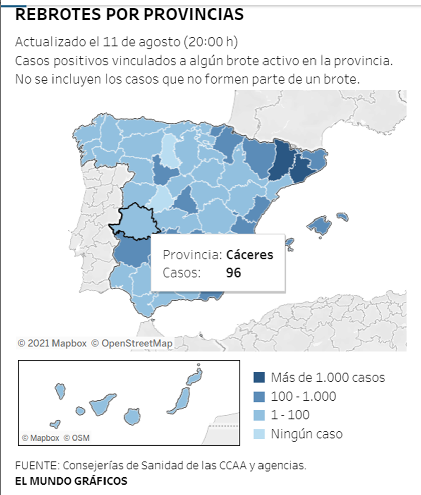

# Actividad Dirigida 2
## [Primera infografía](https://elpais.com/ciencia/2021-03-28/no-respires-el-aire-de-otro-como-esquivar-el-coronavirus-en-interiores.html?prm=ep-app-articulo)
Una de las visualizaciones seleccionadas ha sido publicada el 28 de marzo de 2021 en **Materia**, la web de noticias de ciencia, medio ambiente, salud y tecnología de **El País**. La pieza, titulada *No respires el aire de otro: cómo esquivar el coronavirus en interiores* ha sido realizada por **Mariano Zafra y Javier Salas**.
La he escogido porque creo que es una **visualización muy potente, puesto que reúne todas las herramientas necesarias para sacarle el máximo partido en una web**.

A partir de una **visualización (en movimiento)**, se pretende explicar a los lectores dos claves para diluir la presencia de partículas contagiosas y, de esta forma, evitar los contagios de coronavirus en espacios cerrados.

Mediante una imagen de una cámara de infrarrojos, muestra qué ocurre cuando una persona exhala CO2, indicando que el riesgo es muy bajo en exteriores. Si el usuario hace **scroll con el ratón**, le enseña otra situación diferente. Esta vez dentro de un coche, en el que no hay ventilación. Todo ello con **datos, textos y gráficas en movimiento** para complementar la visualización. Por lo tanto, cada vez que el lector vaya hacia abajo, se irá encontrando con diversas situaciones para conocer cuál sería el riesgo de contagio.

En primer lugar, me parece una gran idea incorporar el **concepto de storytelling dentro de una visualización**. El lector puede ir avanzando poco a poco en la pieza, como si fuese una historia. Esto engancha y, además, hace que no se pierda ninguna información.

Por otro lado, herramientas complementarias como **los colores me parecen muy acertados**. Así pues, cuando el riesgo de contagio es muy alto emplea el rojo, cuando hay riesgo medio utiliza el amarillo y cuando es bajo se ha seleccionado el verde. **Colores muy asociados a las ideas de positivo y negativo y que permiten comprender la información de una manera rápida y visual**.

A pesar de ser una visualización muy potente, creo que tiene un **gran fallo: no se puede ver desde el móvil**. Los medios de comunicación tienen que acostumbrarse a diseñar sus contenidos para estos dispositivos, puesto que la mayoría de los usuarios acceden con ellos a las páginas web. Por lo demás, considero que es un trabajo complejo, pero bastante **intuitivo para los usuarios**, que no rompe con la usabilidad de la web.

## [Segunda infografía](https://www.elmundo.es/ciencia-y-salud/salud/2020/08/06/5f2bd128fc6c83842b8b4632.html)

La siguiente visualización seleccionada ha sido **publicada en El Mundo'** y, según consta en la información de la pieza, su última actualización es del 7 de agosto de 2020.

La noticia trata sobre los **rebrotes de coronavirus en España** hasta dicha fecha. Para mostrar los datos, se ha insertado un **mapa de calor por provincias**, para distribuir los rebrotes activos que había en cada una de ellas.

En primer lugar, me parece **adecuado utilizar estos gráficos** para mostrar, de manera visual, este tipo de informaciones. Los **colores seleccionados también considero que son correctos**, puesto que, mediante una **gama de azules**, señala aquellas zonas con menos casos (azul más clarito) y aquellas con más de 1.000 casos (azul más oscuro).

No obstante, si nos fijamos en la **leyenda**, se divide en: ningún caso, de 1 a 100, de 100 a 1.000 y más de 1.000. Creo que se podría haber añadido algún valor más, puesto que, por ejemplo, de 100 a 1.000 hay una gran diferencia.

Además, si el lector pasa el **cursor por encima**, le aparece **información añadida**, como el nombre de la provincia y el dato concreto de casos que hay.

Cabe añadir que el **mapa está hecho con Mapbox**, una herramienta de desarrollo específica para conseguir gráficos de este tipo. Considero que no es un mal recurso. Sin embargo, teniendo en cuenta que la pieza es de El Mundo, una de las principales cabeceras de nuestro país, quizá deberían optar por **desarrollar ellos mismos estos gráficos, sin depender de terceros**.

En cuanto a su **adaptación a otros dispositivos**, el mapa se visualiza correctamente tanto en ordenador como en el móvil o tablet, muy importante en la actualidad.

Por último, algo que creo que se podría mejorar es que, si el lector hace **click en alguna de las provincias**, esta se selecciona, pero no ocurre nada. Es decir, no aporta información ni ningún dato complementario. Asimismo, deja al resto de provincias en un segundo plano. Creo que esto **genera confusión**, debido que, al quedar marcada, el usuario puede entender que sirve para algo esa función.

